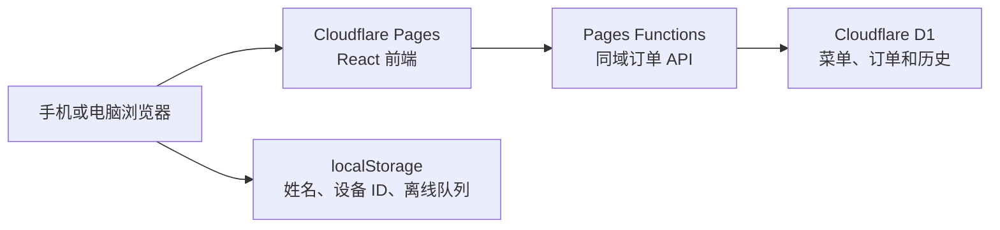

# 异地多人点餐应用设计规格

本规格定义一个面向约 10 人异地同时点餐的网页应用。应用使用 React、Cloudflare Pages Functions 和 Cloudflare D1，不依赖 Cloudflare 之外的后端服务。界面采用已确认的“温暖餐馆风”移动优先设计。

## 目标与范围

应用必须让约 10 名用户通过同一个网址近实时编辑当天订单，并按北京时间保存每日历史。用户无需注册账号，只需输入姓名即可点餐。

本次实现包含以下功能：

- 姓名输入、记忆和更换；
- 单列菜品列表、搜索和数量加减；
- 约 2 秒一次的近实时同步；
- 离线操作队列和自动重放；
- 菜品数量、小计、订单总价和均摊金额统计；
- 手动设置均摊人数；
- 仅在订单总览页显示点菜人姓名；
- 按日期查看历史订单；
- Markdown 菜单导入；
- 餐馆名称配置；
- 管理员菜单、订单和历史管理；
- Cloudflare D1 初始化脚本和部署文档。

本次实现不包含以下功能：

- 菜品分类；
- 菜品介绍；
- 用餐时间选择或时间排名；
- 用户注册和第三方登录；
- 在线支付；
- Cloudflare 之外的数据库或实时服务。

## 用户角色

系统包含普通用户和管理员两个角色。两种角色使用同一个网页，但拥有不同的操作权限。

### 普通用户

普通用户进入网站前必须输入姓名。浏览器必须将姓名和随机生成的设备 ID 保存到 `localStorage`，下次访问时自动填充上次姓名。

普通用户可以：

- 查看当天菜单和订单；
- 搜索菜品；
- 增加或减少自己添加的菜品数量；
- 修改当天的均摊人数；
- 查看订单总览；
- 查看只读历史订单；
- 更换当前姓名。

### 管理员

管理员通过独立密码登录。密码必须存放在 Cloudflare Secret 中，不能提交到 GitHub。

管理员可以：

- 修改餐馆名称；
- 导入、更新、排序或停用菜品；
- 清空或锁定当天订单；
- 修改任意用户的菜品记录；
- 临时解锁历史订单进行修正。

## 视觉与页面结构

界面采用米白背景、暖红强调色和圆角卡片。移动端是主要设计目标，桌面端使用居中的有限宽度内容区，不把手机布局机械拉宽。

### 姓名入口

首次进入时，页面显示姓名弹窗。姓名不能为空，去除首尾空格后长度必须在 1 到 30 个字符之间。

页面允许用户使用已保存的姓名直接进入，也允许用户在进入前修改姓名。更换姓名不会更换设备 ID，因此系统仍能识别同一设备的待同步操作。

### 菜单首页

首页顶部必须显示：

- 餐馆名称，默认值为“今日点餐”；
- 当前北京时间日期；
- 当前用户姓名；
- “已同步”“同步中”“离线”或“同步失败”状态；
- 菜品搜索框。

菜品使用单列卡片连续排列。每张卡片只显示：

- 菜品名称；
- 单价；
- 所有用户添加的总数量；
- 当前用户添加的数量；
- 增加和减少按钮。

首页不能显示其他点菜人的姓名，也不能显示菜品介绍或分类。

页面底部必须固定显示：

- 已点总份数；
- 订单总价；
- 手动设置的均摊人数；
- 每人均摊金额；
- 进入订单总览的按钮。

### 订单总览

订单总览必须按菜品显示数量、单价、小计和点菜人姓名。相同姓名只显示一次；如果同一人添加多份，可以显示为“张三 × 2”。

订单总览底部必须显示总份数、总价、均摊人数和每人均摊金额。均摊人数由用户手动设置，不从点菜人姓名自动推导。

### 历史订单

历史页按日期倒序显示已有订单。系统按 `Asia/Shanghai` 时区确定业务日期，并在北京时间每天 00:00 切换到新的当天订单。

历史订单默认只读。服务端必须拒绝普通用户对历史日期的写入，不能只依赖前端隐藏按钮。管理员可以临时解锁指定日期进行修正。

### 管理设置

管理页必须提供餐馆名称编辑、Markdown 菜单预览与导入、菜品排序、菜品停用、订单清空和订单锁定功能。

管理员执行破坏性操作前必须看到明确的二次确认。清空订单不能删除操作审计记录。

## 点餐与计费规则

每位用户只修改自己的菜品贡献数量。系统将所有用户的贡献相加，得到菜品总数量。

例如，张三添加 1 份酸菜鱼，李四添加 1 份酸菜鱼时，菜单首页显示“酸菜鱼 × 2”，订单总览显示“点菜人：张三、李四”。

减少按钮必须优先减少当前设备对应用户自己的数量。当前用户的数量为 0 时，减少按钮必须禁用。管理员可以在订单总览中纠正其他用户的数量。

所有金额必须以整数“分”存储和计算。界面在显示时将金额格式化为人民币元，避免使用浮点数直接累计。

计算公式如下：

```text
菜品小计 = 菜品单价 × 菜品总数量
订单总价 = 所有菜品小计之和
每人均摊 = 订单总价 ÷ 手动均摊人数
```

均摊人数必须大于或等于 1。显示金额时保留两位小数；无法整除产生的分币差额只作为显示结果，不自动分配给特定姓名。

## 同步与冲突处理

前端必须每 2 秒请求一次增量状态。页面重新获得焦点、网络恢复或用户完成写操作时，前端必须立即触发同步。

页面进入后台后可以将轮询间隔增加到 10 秒，以减少请求。页面回到前台时必须立即恢复 2 秒轮询。

### 独立贡献记录

系统不能让所有用户直接覆盖同一个菜品总数字。D1 必须分别保存“日期、菜品、设备”对应的贡献数量，再在查询时汇总。

这种结构允许张三和李四同时增加同一道菜，而不会发生最后一次写入覆盖前一次写入的问题。

### 幂等操作

每次写操作必须带唯一的 `operationId`。推荐格式如下：

```text
<deviceId>-<timestamp>-<random>
```

服务端必须对 `operationId` 建立唯一约束。网络重试提交同一个操作时，服务端返回第一次操作的结果，不能重复增加数量。

### 修订版本

每天的订单必须维护递增的 `revision`。成功修改菜品数量、均摊人数或订单锁定状态后，服务端必须增加修订版本。

前端轮询时发送最后看到的修订版本。修订版本未变化时，服务端可以返回无更新响应；版本变化时返回最新订单快照。

### 离线队列

网络不可用时，前端必须将用户操作加入 `localStorage` 待同步队列，并立即显示“离线，修改待同步”。

网络恢复后，前端按创建顺序重放操作。服务端使用 `operationId` 去重，重放完成后前端重新拉取完整状态。失败的操作必须保留并显示可重试提示，不能静默丢弃。

## Cloudflare 架构

应用使用 Cloudflare Pages 托管 React 静态资源，使用 Pages Functions 提供同域 API，使用 D1 保存菜单、订单和历史。



GitHub 仓库必须可以直接连接 Cloudflare Pages。构建命令使用 `npm run build`，静态输出目录使用 `dist`，D1 绑定名称使用项目配置中约定的统一名称。

## 数据模型

D1 使用关系表保存配置、菜单、每日订单、用户贡献、幂等操作和审计记录。

### `settings`

`settings` 保存全局配置。

| 字段 | 类型 | 说明 |
| --- | --- | --- |
| `key` | `TEXT PRIMARY KEY` | 配置键 |
| `value` | `TEXT NOT NULL` | 配置值 |
| `updated_at` | `TEXT NOT NULL` | 更新时间 |

餐馆名称使用 `restaurant_name` 配置键，默认值为“今日点餐”。

### `menu_items`

`menu_items` 保存当前和历史菜品定义。

| 字段 | 类型 | 说明 |
| --- | --- | --- |
| `id` | `TEXT PRIMARY KEY` | 稳定菜品 ID |
| `name` | `TEXT NOT NULL` | 菜品名称 |
| `price_cents` | `INTEGER NOT NULL` | 单价，单位为分 |
| `sort_order` | `INTEGER NOT NULL` | 显示顺序 |
| `active` | `INTEGER NOT NULL` | 是否在当前菜单显示 |
| `created_at` | `TEXT NOT NULL` | 创建时间 |
| `updated_at` | `TEXT NOT NULL` | 更新时间 |

菜品不能包含介绍或分类字段。

### `daily_orders`

`daily_orders` 保存每日结算状态。

| 字段 | 类型 | 说明 |
| --- | --- | --- |
| `order_date` | `TEXT PRIMARY KEY` | 北京时间业务日期，格式为 `YYYY-MM-DD` |
| `share_count` | `INTEGER NOT NULL` | 手动均摊人数，默认 1 |
| `revision` | `INTEGER NOT NULL` | 订单修订版本 |
| `locked` | `INTEGER NOT NULL` | 是否锁定 |
| `updated_at` | `TEXT NOT NULL` | 更新时间 |

### `order_contributions`

`order_contributions` 保存每台设备对菜品的贡献数量。

| 字段 | 类型 | 说明 |
| --- | --- | --- |
| `order_date` | `TEXT NOT NULL` | 业务日期 |
| `menu_item_id` | `TEXT NOT NULL` | 菜品 ID |
| `device_id` | `TEXT NOT NULL` | 本地设备 ID |
| `display_name` | `TEXT NOT NULL` | 最近使用的姓名 |
| `quantity` | `INTEGER NOT NULL` | 当前贡献数量 |
| `updated_at` | `TEXT NOT NULL` | 更新时间 |

联合主键为 `order_date、menu_item_id、device_id`。数量必须大于或等于 0。

### `operations`

`operations` 保存幂等写操作。

| 字段 | 类型 | 说明 |
| --- | --- | --- |
| `operation_id` | `TEXT PRIMARY KEY` | 客户端唯一操作 ID |
| `order_date` | `TEXT NOT NULL` | 业务日期 |
| `device_id` | `TEXT NOT NULL` | 操作设备 |
| `operation_type` | `TEXT NOT NULL` | 操作类型 |
| `payload_json` | `TEXT NOT NULL` | 规范化操作参数 |
| `created_at` | `TEXT NOT NULL` | 创建时间 |

### `activity_log`

`activity_log` 保存可追溯审计记录。

| 字段 | 类型 | 说明 |
| --- | --- | --- |
| `id` | `INTEGER PRIMARY KEY AUTOINCREMENT` | 日志 ID |
| `order_date` | `TEXT NOT NULL` | 业务日期 |
| `device_id` | `TEXT` | 操作设备 |
| `display_name` | `TEXT` | 操作者姓名 |
| `action` | `TEXT NOT NULL` | 操作名称 |
| `details_json` | `TEXT NOT NULL` | 修改详情 |
| `created_at` | `TEXT NOT NULL` | 创建时间 |

## API 设计

所有 API 与网页同域并使用 JSON。服务端必须验证日期、名称长度、数量范围、金额范围和管理员权限。

### 查询接口

查询接口返回页面所需状态，不让浏览器直接访问 D1。

- `GET /api/bootstrap?date=YYYY-MM-DD`：返回餐馆配置、菜单、指定日期订单和当前修订版本；
- `GET /api/order/changes?date=YYYY-MM-DD&since=<revision>`：返回无更新标记或最新订单快照；
- `GET /api/history`：返回可查看的历史日期列表；
- `GET /api/history/:date`：返回指定历史订单。

### 普通写入接口

普通写入接口只允许修改当天且未锁定的订单。

- `POST /api/order/adjust`：增加或减少当前设备对菜品的贡献数量；
- `PUT /api/order/share-count`：更新当天的均摊人数；
- `PUT /api/profile/name`：可选地更新当前设备在已有贡献记录中的显示姓名。

### 管理接口

管理接口必须验证管理员会话。

- `POST /api/admin/login`：验证密码并设置短期安全 Cookie；
- `POST /api/admin/logout`：清除管理员 Cookie；
- `PUT /api/admin/settings/restaurant-name`：修改餐馆名称；
- `POST /api/admin/menu/import`：确认并写入 Markdown 菜单；
- `PUT /api/admin/menu/reorder`：调整菜品顺序；
- `POST /api/admin/order/clear`：清空指定日期订单并保留审计日志；
- `PUT /api/admin/order/lock`：锁定或临时解锁指定日期；
- `PUT /api/admin/contribution`：修正指定用户的菜品数量。

## Markdown 菜单导入

菜单导入只要求菜品名称和价格。解析器必须支持列表和 Markdown 表格两种格式。

列表格式如下：

```markdown
- 酸菜鱼 | 68
- 小炒黄牛肉 | ¥48
- 干锅花菜 | 32.00
```

表格格式如下：

```markdown
| 菜品 | 价格 |
| --- | ---: |
| 酸菜鱼 | 68 |
| 小炒黄牛肉 | 48 |
```

解析器必须：

- 去除 `¥`、`￥` 和“元”；
- 支持整数和最多两位小数；
- 忽略 Markdown 标题和分类标题；
- 保持菜品出现顺序；
- 拒绝空名称、非数字价格、负数价格和重复行；
- 在预览中显示错误行号和原因；
- 将同名菜品视为更新，而不是重复创建；
- 将导入结果中不存在的旧菜品设为停用，不能物理删除历史引用。

管理员确认预览后，系统才能写入 D1。

## 权限与安全

普通用户无需登录，但所有写接口必须限制单次增减范围，并验证设备 ID、姓名和菜品是否有效。

管理员密码必须通过 Cloudflare Secret 注入。管理员登录接口验证密码后，使用 HMAC 签名的短期 `HttpOnly`、`Secure`、`SameSite=Lax` Cookie 保存会话。

服务端必须执行以下限制：

- 普通用户只能修改当天订单；
- 锁定订单不能被普通用户修改；
- 数量不能小于 0；
- 单次调整值只能为 `+1` 或 `-1`；
- 均摊人数必须在 1 到 100 之间；
- 名称长度必须在 1 到 30 个字符之间；
- 菜品名称长度必须在 1 到 80 个字符之间；
- 价格必须在 0 到 10000000 分之间；
- 请求体大小必须受限；
- API 不开放跨域写入。

## 错误处理

界面必须区分网络错误、输入错误、订单锁定、历史日期只读、管理员会话失效和服务器错误。

写操作失败时，前端不能直接丢弃乐观更新。前端必须重新读取服务端状态，并在必要时保留待重试操作。管理员菜单导入失败时，页面必须保留原始 Markdown 文本和解析预览。

## 测试与验收

实现必须包含单元测试、API 测试和浏览器关键路径测试。

单元测试必须覆盖：

- Markdown 列表和表格解析；
- 金额解析与格式化；
- 菜品小计、总价和均摊金额；
- 贡献数量聚合；
- 北京时间业务日期；
- 离线队列去重和重放顺序。

API 测试必须覆盖：

- 同一道菜的并发用户贡献不会互相覆盖；
- 相同 `operationId` 不会重复执行；
- 普通用户不能修改历史或锁定订单；
- 贡献数量不能减到 0 以下；
- 均摊人数范围校验；
- 管理员菜单导入、锁定和清空权限。

浏览器关键路径必须覆盖：

1. 首次输入姓名并保存；
2. 添加和减少菜品；
3. 打开订单总览并看到点菜人姓名；
4. 修改均摊人数并看到金额更新；
5. 模拟第二位用户更新后在轮询周期内看到变化；
6. 离线操作在恢复网络后成功同步；
7. 查看历史订单；
8. 管理员导入 Markdown 菜单。

移动端验收至少覆盖 375×812 像素视口，桌面端至少覆盖 1440×900 像素视口。页面不能出现横向滚动、主要按钮被遮挡或底部结算栏覆盖最后一项菜品的问题。

## 已确认的设计决策

截至 2026 年 7 月 30 日，项目已确认以下决策：

- 使用 Cloudflare Pages Functions、D1 和约 2 秒一次的定时同步；
- 不使用 Cloudflare 之外的后端服务；
- 只服务一家餐馆；
- 普通用户只输入姓名；
- 餐馆默认名称为“今日点餐”；
- 不显示菜品分类；
- 不提供用餐时间选择；
- 不显示菜品介绍；
- 首页不显示点菜人姓名；
- 订单总览显示点菜人姓名；
- 均摊人数由用户手动设置；
- 视觉采用温暖餐馆风和移动优先单列布局。
